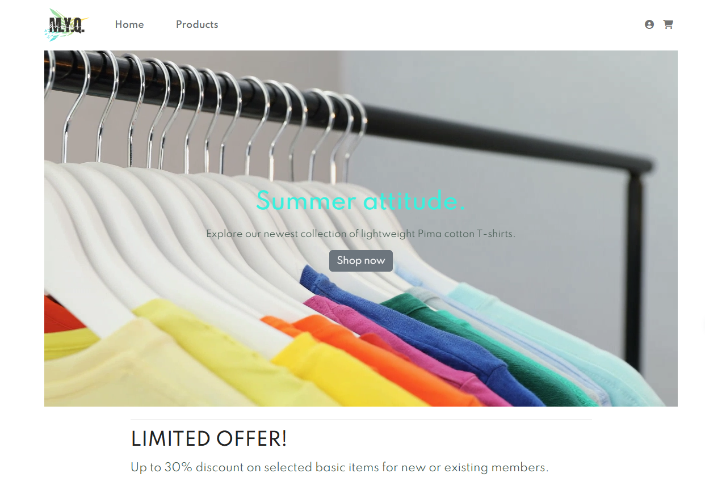
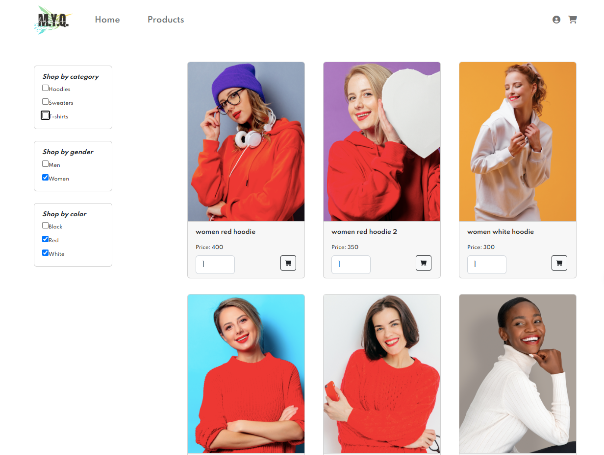
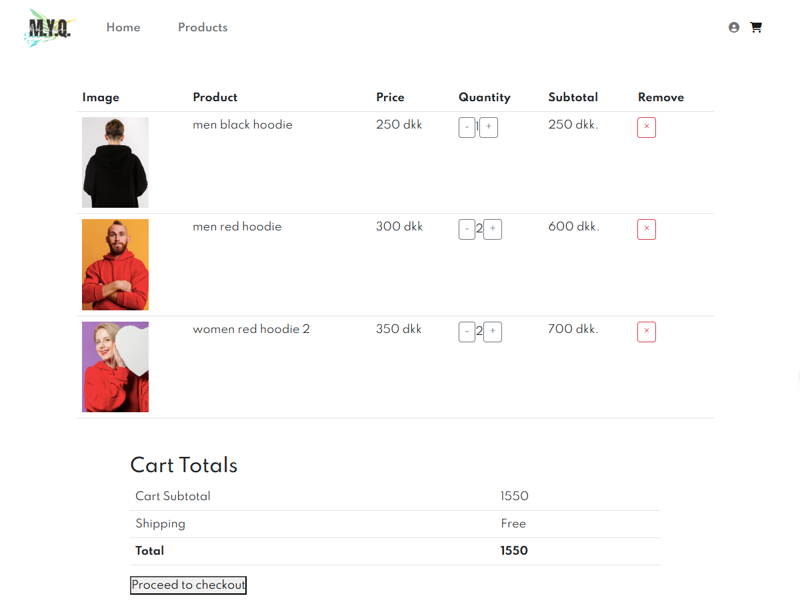

# T-Shirt E-Commerce Website

A full-stack e-commerce web application built with React and express for T-shirt enthusiasts. The platform includes a responsive design, user authentication, and a shopping cart system.

## Key Features

- 📱 Responsive design for desktop and mobile devices
- 🛍️ Browse T-shirts across multiple categories
- 🔐 User authentication (login/register)
- 🛒 Shopping cart functionality

## Setup

### Install dependencies and run the server:

```
cd server

npm install

npm run watch
```

### Install client dependencies and run the client:

```
cd client

npm install

npm start
```

The website will open in your default browser at `http://localhost:3000`.

## Website design

### Home page



### Products page



### Cart page


